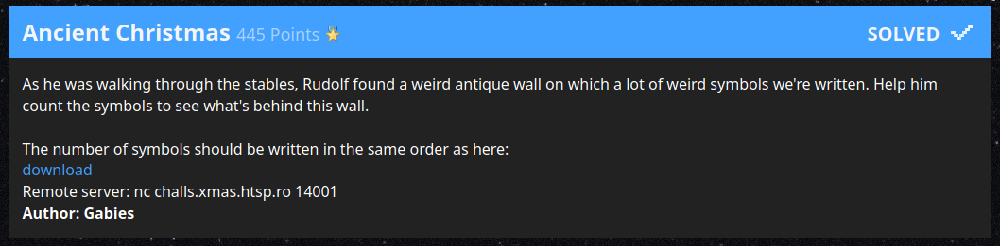
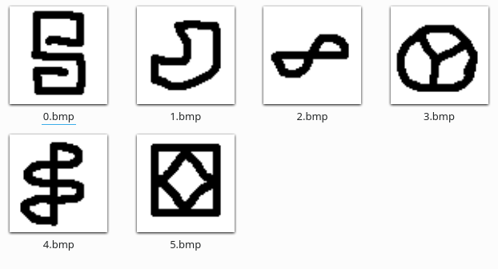
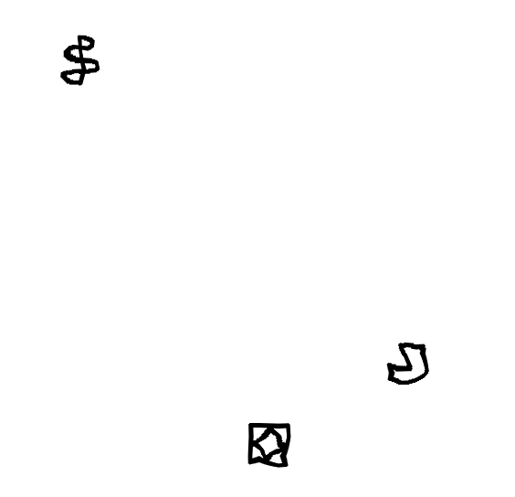

# Ancient Christmas

> As he was walking through the stables, Rudolf found a weird antique wall on
> which a lot of weird symbols we're written. Help him count the symbols to see
> what's behind this wall.
>
> The number of symbols should be written in the same order as here:
>
> *link to attachment*



| Asset        | Note                                                          |
|--------------|---------------------------------------------------------------|
| Author       | Gabies                                                        |
| Category     | PPC                                                           |
| Original URL | `nc challs.xmas.htsp.ro 14001`                                |
| Attachment   | 💾 [Cached][1] 💾 [Google Drive][2]
| Writeup by   | Kris and Max                                                  |

**We got first blood on this one (although maybe not fully deserved).**

[1]: ./files
[2]: https://drive.google.com/drive/folders/1MTTRQ0PN1W1r8-MV_1zl5kf6F4uuHCJc

## Analysis

The attached media for this challenge includes these symbols:



Upon connecting to the provided netcat server (and completing the standard
sha256 proof of work) you will be greeted with:

```
Base64 encoded image for challange #1:
b'iVBORw0KGgoAAAANSUhEUgAAAooAAAKKCA ...snip... '
Give me the number of symbols separated by commas (e.g. 0,1,2,3,4,5)
```

Sure enough this string contains a base64 encoded image. A simple way to
look at it is to paste it into e.g. the Firefox URL bar and prepend it with
`data:image/jpeg;base64,`. You'll of course eventually want a script (you
cannot count the symbols by hand because there is a strict time limit of a
few seconds), but this will clearly be an image processing task and choice of
language might matter, so you might not want to invest too much time up-front.

Here is a section of an image you might be given:



We can see that symbols are neither rotated nor scaled nor overlapping, but
they are warped in some way. The images start out at around 1000x1000 and
grow up to 6000x6000 over the ten rounds that you have to beat in one run.

Seeing this first image already helps narrow down the potential approaches:

- You cannot use exact pixel matching due to the warping.
- You might be able to get somewhere with more fuzzy matching (i.e. a
 convolution might still work), but to get that fast you might need to do it
 in frequency space. I didn't want to mess with that.
- Neural networks could be used to classify each bit, but getting that to work
 might take an unknown amount of time.

I considered it unlikely that this challenge would require neural networks, so
I took another look at the symbols to see if there is any structure or any
invariant I can use for counting. And sure enough, after a few glances I
noticed the key to this challenge: Symbol `X.bmp` has exactly `X+1` disconnected
white patches (or, equivalently, encloses `X` white patches).

Assuming that the warping (and JPEG compression) don't mangle the symbols too
hard, this challenge is easily solved by counting the number of white patches
in a given symbol to determine which symbol it is.

In image processing (which is essentially my day job) this is called
[Connected-component Labeling][3], and a function for this should be available in
any mature image processing library. Python surely has those, but none of them
were installed on my system. In fact, Kali doesn't even come with `pip` for
some reason. Since my "Linux adult" Kris was fast asleep on the other side of
the world and I remembered the amount of python reinstallations working with
Tensorflow in a different project entailed, I decided to not mess with my
python installation and instead write a connected component function by hand.
(Yes, I can hear the facepalms from here, but there was a "crystal clear, fun"
path and a "unknown amount of unfun garbage" path, so I chose the former. If
I didn't enjoy writing this stuff I wouldn't have come to this category.)

Implementing that using floodfills (i.e. graph traversal) allowed me to also
tailor the algorithm to exactly what I needed. The algorithm was thus:

1. Find a black pixel anywhere.
2. Floodfill the connected black pixels, storing any adjacent white pixels
   in a list `A`. Also keep a bounding box of this area for later.
3. Give each pixel in `A` a unique label.
4. Starting from the set of pixels in `A`, floodfill all the adjacent white
   areas. Give newly visited white pixels the label that we visited it from,
   and also keep track of which labels end up touching (i.e. where we did
   not visit a neighbor it already had a label).  
   This was also limited to the above bounding box to  (increased by one pixel
   in each direction so that the outer white patches remain connected).
5. Merge labels that touched.
6. Count how many labels remain to find which symbol we are looking at.
7. Remove the black pixels flooded in step 1.
8. Repeat all of the above until no more black pixels are found.

The main challenge was the label tracking and merging. I'm sure there has to
be some efficient way to do this, but after mentally approaching it from
three different ways without finding a general solution, I just decided to
implement a straightforward one. Of course it didn't work right away, but
repeating it a few times got the job done. I guess that's one CTF lesson for
me (and why this is also a refreshing experience):  
**It doesn't have to be pretty or general.** It just needs to get the job done.
Know your algorithms and their limitations and match them with what the
problems require.

You can find the final state of the code in [`demangler.py`][4].

Some further notes:

- Using bounding boxes proved to be a really good idea. From what I read,
  Gabies intended people to find connected components in the entire image,
  which (for a 6000x6000 image) might take a lot of time when implemented
  by hand (in Python). I could identify each symbol within under 100 ms
  using my approach.

- Storing the last received image and adding an option to use that instead of
  going through the POW and image decoding again turned out to be similarly
  useful. Especially for debugging it is really helpful to work with
  consistent inputs.
  
- Initially my code was way too slow. After profiling all the difficult parts
  of the algorithm and finding out that they were really fast, I identified a
  loop over an `enumerate` over the whole image as the culprit (which I was
  only using to find the location of the minimum pixel value, i.e. the next
  black pixel). Being pretty green at python, I was surprised by a range
  expression of sorts being such a massive bottleneck. But `np.argmin` +
  `np.unravel_index` solved that problem.

- The POW when implemented the trivial way in python would occasionally take
  a minute or more, which can become really frustrating. After trying a
  multithreaded python solution, Kris eventually produced a really nice
  multithreaded C++ version (find it [here][6]) that would usually complete
  the POW in seconds. We benefitted from this greatly for the subsequent
  challenges.

- We couldn't get past round 6. Ignoring the times I got the answer wrong
  (which involved a distinct server message) the connection would always die
  after the sixth round. Others faced similar issues. After figuring out the
  algorithm and writing code that could obtain the flag, I had to go to bed
  frustrated. The next morning, Kris got in touch with Gabies, based on the
  hunch that the server ran out of memory when creating really large images.
  This turned out to be correct, so after raising the limits of each docker
  instance (twice) and returning PNG instead of JPEG images, the challenge
  became beatable.
  
- The JPEG images had some compression artefacts that could interfere with the
  correct symbol detection described above. That luckily went away after the
  switch to PNG.
  
- I also figured out a bug with my implementation in the meantime (my horrible
  label merging did not perform enough iterations) that caused wrong answers
  to be given occasionally.
  
We were of course waiting for the server-side fix and made sure to grab the
flag immediately, and ended up as the first ones to get it. I'm pretty sure
others had also solved the challenge half a day earlier (i.e. when I went to
bed) but were blocked by the server bug. So we probably didn't formally
deserve the first blood, but we did do our best to get it.

[3]: https://en.wikipedia.org/wiki/Connected-component_labeling
[4]: ./demangler.py
[5]: https://github.com/okdshin/PicoSHA2
[6]: https://github.com/krisives/shapow
