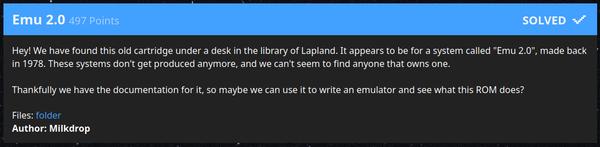

# Emu 2.0

> Hey! We have found this old cartridge under a desk in the library of Lapland.
> It appears to be for a system called "Emu 2.0", made back in 1978. These
> systems don't get produced anymore, and we can't seem to find anyone that owns
> one.
>
> Thankfully we have the documentation for it, so maybe we can use it to write
> an emulator and see what this ROM does?



| Asset        | Note                                                          |
|--------------|---------------------------------------------------------------|
| Author       | Milkdrop                                                      |
| Category     | Emulation                                                     |
| Attachment   | 💾 [Cached][1] 💾 [Original Link][2]                          |

## Analysis

This is a very basic, but interesting, machine to emulate. It's basically an
8-bit microprocessor with a 12-bit address bus. It has a single register (`A`)
and supports addition, bitwise and, bitwise or, bitwise xor and basically a
single addressing mode.

The challenge here was to write the code within the given time and not worry
about it being perfect. The main "gotchas" here are that the PDF documentation
includes subtle notes that you can easily miss. For example, undefined opcodes
should be implemented as `A = A - 1` which is strange.

One interesting feature of this machine is that you can "block" and "unblock"
writes to certain memory addresses.

The ROM provided is 3840 bytes but actually only the first `0x350` are used.

## Implementation

The code is implemented in `vm.cpp` and contains a `main()` method that loads
the ROM from standard input. The rest of the implementation is in the `VM`
class since it was unclear how complex it would get when starting.

When ran it will dump it's "assembly" to standard error and the serial output
will be written to standard output:

```
$ ./milkvm < files/rom > flag.txt
$ cat flag.txt
X-MAS{S4nt4_U5e5_An_Emu_2.0_M4ch1n3}
```

## Notes

* RAM is stored in a 64kb buffer and this could have been smaller
* Write masking is implemented as an array of booleans, maybe the compiler is
  doing something smart there but it could have been `std::bitset`
* IO is happening using C instead of C++ because we only had time for a single
  `fread()`
* Assembly syntax printed is garbage
* Wanted to execute until the `X-MAS{...}` flag format was found but settled for
  just letting it run and killing it. Thankfully it ends with `jmp $0408` loop

[1]: ./files/
[2]: https://drive.google.com/drive/folders/1O2cPJq56G0APoBIAOhXuxJsXE11WCmu-?usp=sharing
