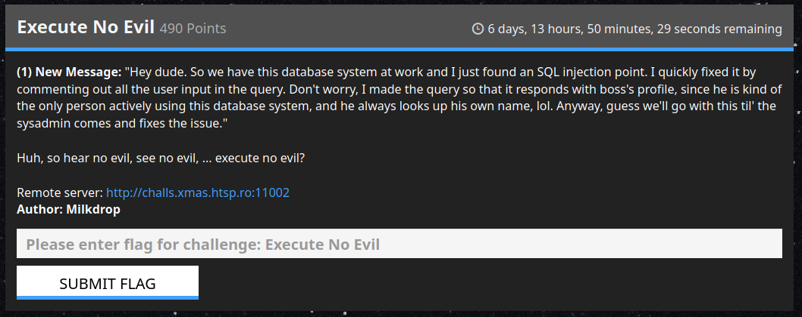
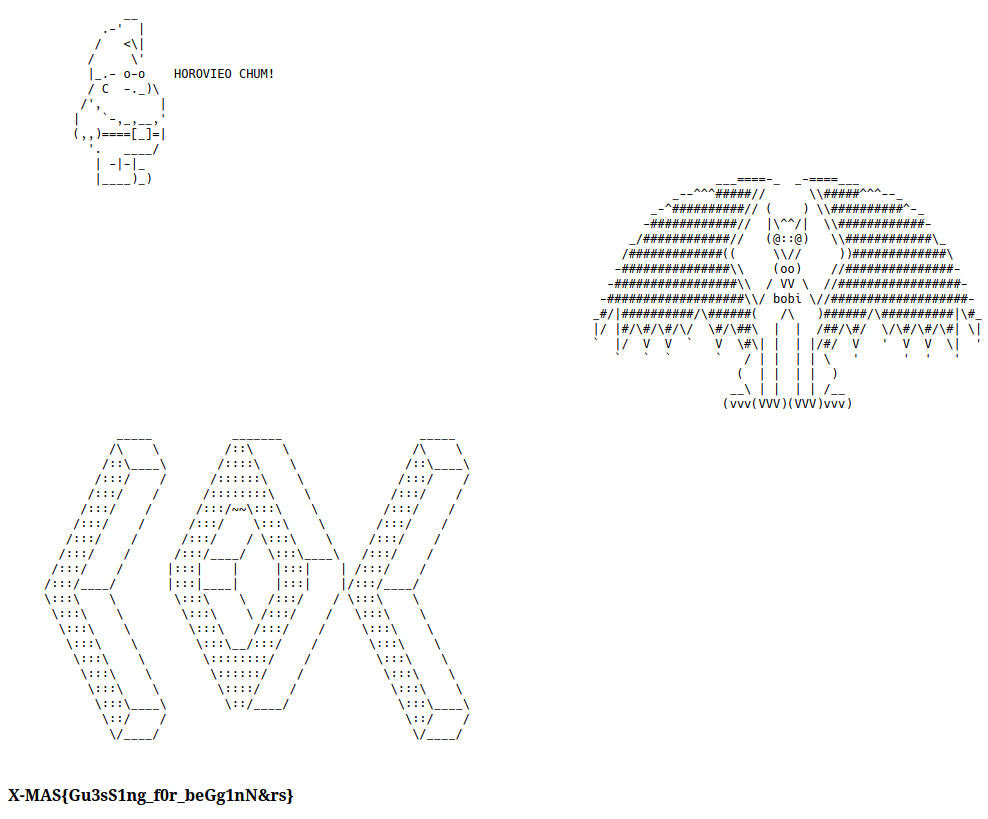

# Gnome's Buttons V2

> **WARNING: GUESSING**
> HOROVIEO CHUM! ME donut like cukies anymor! Git me some gud TAITAL!
>
> kisses from @trupples



## Analysis

You go the URL provided and you'll see an ASCII art style page:



Any attempt to add URL parameters will bring you back to the URL `?a=b`. Viewing
the source code the challenge will only show a single "hint":

```
<title>nobody:- title:play with me bruh</title>
```

Now if you go to the site and enter `?title=abc` you'll not be redirected to the
`?a=b` URL. If you try entering `?title=flag` you'll be given the message:

```
You're close portocala....
```

After that there are no more hints we could find. We randomly tried `title=fl4g`
and got the flag. We did not enjoy this challenge and we think it shouldn't have
been part of the Web Exploitation category. If such a challenge should exist it
should be in it's own category such as "Guessing" so that people interested in
actual interesting things can avoid it.
