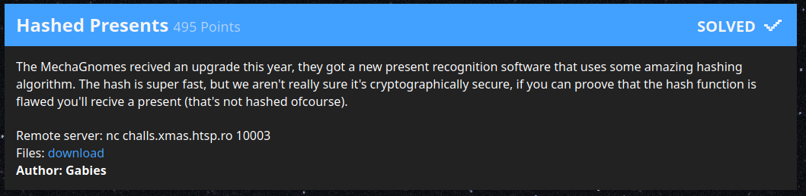

# Hashed Presents

>  The MechaGnomes recived an upgrade this year, they got a new present
>  recognition software that uses some amazing hashing algorithm. The hash is
>  super fast, but we aren't really sure it's cryptographically secure, if you
>  can proove that the hash function is flawed you'll recive a present (that's
>  not hashed ofcourse).



Original URL:

| Asset        | Note                                                          |
|--------------|---------------------------------------------------------------|
| Author       | Gabies                                                        |
| Category     | Cryptography                                                  |
| Original URL | `nc challs.xmas.htsp.ro 10003`                                |
| Attachment   | 💾 [Cached][1] 💾 [Original Link][2]                          |

---

_Writeup by Max_

Kris asked me to help with this challenge. He showed me the hash function and told me we need to produce a hash collision for a given input (with some further restrictions on the strings we can feed it).

I'm not too proud of how this one went. A lot of more or less random trial and error on code in the hopes of stumbling on the right solution, even though the idea itself was pretty clear from the start. I need to do more crypto...


## Analysis

The server generates a random 30-34 character string from some set of characters and hashes it. It presents both of these to you and asks for an input that has the same hash.

The hash function is available in the server files:

```
class secureHash(object):
    def __init__(self):
        self.bits = 128
        self.mod = 2**128
        self.mask = 2**128 - 1
        self.step = 23643483844282862943960719738L
        self.hash = 9144491976215488621715609182563L

    def update(self, inp):
        for ch in inp:
            self.hash = ((self.hash + ord(ch)) * self.step) & self.mask

    def hexdigest(self):
        x = self.hash
        out = ''
        for i in range(self.bits/8):
            out=hex(x & 0xff)[2:].replace('L','').zfill(2)+out
            x >>= 8
        return out
```

The first few things I discussed with Kris were:
  - This is a multiplicative hashing algorithm.
  - The `step` is even, which has fun consequences.
  - Step and initial hash are orders of magnitude below the mask (i.e. they are pretty small numbers in the hash state space).

In my job I've occasionally had to hash a bunch of objects for debugging purposes, just to check at which point different executions of a program diverge (i.e. to check consistency). Sadly, C++ does not have a `hash_combine` functionality available, so aggregating the hashes of
two objects requires manual work. A simple but effective method for this (but certainly not a cryptographic) purpose is Fibonacci Hashing, which is explained well [here](https://book.huihoo.com/data-structures-and-algorithms-with-object-oriented-design-patterns-in-c++/html/page214.html). I've considered the properties of this hashing algorithm before, so the below analysis came to me quickly: In my mind, this challenge does the same thing as Fibonacci Hashing, but with a terrible constant.

For the above code, a byte string `s` of length `7` hashes to

```h(s) = init * a**7 + s[0] * a**7 + s[1] * a**4 + ... + s[5] * a**2 + s[6] * a**1  (mod 2**128)```

with `a = 23643483844282862943960719738` and `init = 9144491976215488621715609182563`.

If `a` is even (as in this challenge), it should be immediately obvious that the last bit of the hash is always `0` (exception: The empty string hashes to `init` and is the only input to do so). Similarly, the second-to-last bit of the hash depends only on `s[6]` (all other input bytes are multiplied by at least `a**2`, which is a multiple of four). The third-to-last bit can only depend on `s[6]` and `s[5]`, and so on.

It should become clear that only the last 128 bytes of the input contribute to the hash. All preceding ones are multiplied with at least `a**128`, which ends in 128 zeros in base 2. In other words, **all inputs with the same 128 byte suffix hash to the same value (i.e. collide)**. Sadly, this alone doesn't solve the challenge: The inputs we get are shorter than 128 bytes.


Also note that prepending zeros to a given input does in principle keep the hash constant - except that it changes the number of times we multiply `init` by `a`. If you find a prefix that hashes to the `init` value that would allow you to collide every hash immediately (just prepend the prefix), but 

Still, the above observation paves the way to an algorithm for producing a collision:

  1. Start with any byte sequence `s`. The last bit of its hash is zero, and the target hash should also have a zero at the last bit (if not, we can't collide it because only the empty sequence hashes to an odd number).
  2. Move on to the second bit: It may be currently `1` or `0`. In the former 

## Implementation

During the challenge, I realized that we can set one bit of the output hash with the lowest bit of every input byte. But instead of analyzing further and arriving at the above algorithm, I decided to (try and) trial-and-error my way through the rest. There are only so many combinations of comparison between target and current hash bit + choice of byte (odd or even) to append, I figured I would eventually get it right. That did not really work - there were additional "degrees of freedom" (most of which would be incorrect) in how to implement the algorithm due to the first bit being fixed and the initial byte sequence choice being arbitrary.

I went through many iterations of slightly broken code and had to use Kris for rubber-ducking before eventually settling on Doing It Right(TM) and thinking things through. The final code is in [`hashColl.py`][3], which still uses a hardcoded collision target. The actual flag collection (which involves ten rounds of finding a collision after comleting the standard sha256 proof of work) was done by manually copying the target from commandline to the script, running the script in a different terminal, then copying the colliding input back over.

As an example, the server would ask for a string that has the same has as the input `]5ZOQljM01T[3,k=8Soef*[3vlD2L1w!`. Running our python script with `obj1 = "]5ZOQljM01T[3,k=8Soef*[3vlD2L1w!"` would output:

```
]5ZOQljM01T[3,k=8Soef*[3vlD2L1w! hashes to 142811364961261228132921150077308146974 = 0x6b7077ea3a1e0e5bd28dcd8309d6951e
Target int : 0x6b7077ea3a1e0e5bd28dcd8309d6951e
Target:  1101011011100000111011111101010001110100001111000001110010110111101001010001101110011011000001100001001110101101001010100011110
cbbcccbcccbbbccbbbbcbbccccbccbcbccccbbbbbcbcbbcbbcccbbccccbbcbbbbccccccbcbbcbbcccccbbcccccbccbbbcbcbbbbccccccbcccbcccbbcbccbccbc hashes to 142811364961261228132921150077308146974 = 0x6b7077ea3a1e0e5bd28dcd8309d6951e
```

Notice that our chosen input is 128 characters of `b` or `c`, each one chosen succesively to produce the correct next bit of the 128 bit target hash.

There was some residual worry that between the terminal (Ctrl+Shift+C for copying), the text editor (Ctrl+V) and the other terminal (Ctrl+Shift+C) I would eventually Ctrl+C the server connection and we had to start over, but that was luckily avoided.


[1]: ./files
[2]: https://drive.google.com/drive/u/1/folders/1rQISk-f_phfDOK-JP4zp9VIwntHxzM-k?usp=sharing
[3]: ./hashColl.py
