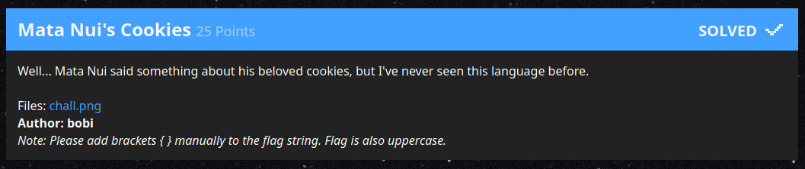

# Mata Nui's Cookies

> Well... Mata Nui said something about his beloved cookies, but I've never seen this language before.
>
> _Note: Please add brackets { } manually to the flag string. Flag is also uppercase._
>
> *link to attachment*

| Asset        | Note                                                          |
|--------------|---------------------------------------------------------------|
| Author       | bobi                                                          |
| Category     | Cryptography                                                  |
| Attachment   | 💾 [Cached][1] 💾 [Google Drive][2]
| Writeup by   | Max                                                           |

[1]: ./files
[2]: https://drive.google.com/file/d/1hns2INcX3NaaDfdn-tXt-Q4-C8vwLeAQ/view

---

This is the first challenge of this competition that I went for after sampling challenges from the different categories.

## Analysis

The provided image:

![chall.png][4]

This immediately looks like a substitution cipher, just using symbols instead of characters. With this being the first crypto challenge (also giving only 250 instead of the normal 500 points) it stands to reason that the symbols also have some sort of visual connection to the letters they represent.

A quick web search for "Mata Nui" clarifies this challenge being a reference to Lego Bionicle, which I've had brief exposure to some 15 years ago. I suppose the symbols follow the Bionicle design to an extent - the Lego Bionicle figure I had could be folded into a ball shape with shields on each side, which the symbols reminded me of. [Here][3] is a build+review with relevant pictures for the uninitiated :)

The first thing I did was take the picture into Paint.NET (yes, I'm the Windows guy in the team, fight me) and giving each symbol a unique coloring, also trying to choose similar colors for similar symbol elements.

Why? This is probably my main advice for people not only into CTF but almost any problem solving:

**There is only one broadband connection into the brain - your eyes. Use them to the maximum extent possible.**

Maybe I'm a "visual type", but we have evolved over millenia to immediately pick out patterns, irregularities and structure in everything we see. Our eyes have inbuilt line detection, our brains have shape and pattern recognition. And it pays to bring data into a form that helps your eyes and brain at their tasks. Compare the original with the colored version:

![chall.png][4]
![Symbols colored][5]

Now let's get to decoding. The `-` symbol is a dead giveaway that the plain text starts with `X-MAS`, and the first symbol obviously matches the `X`. It becomes clear that this is indeed just the ciphered flag (without the `{` `}` that the challenge notes to add manually). 

I initially wanted to do further deciphering in Paint.NET (I even figured out which font size to use) but quickly realized it would be cumbersome, so I took it into Excel. *cue audience groaning*

![Decoding in excel, step 1][6]

Substituting in the known characters `M`, `A` and `S` we get the above. Take note of the degree of similarity between plaintext character and cypher symbol - consider symmetry, vertical/horizontal as well as curved lines. There doesn't seem to be a hard rule, but it will still help with further deciphering.

Looking at the first gap, `T` is the obvious candidate - it matches the symbol shape and we get `MATA` as the first word. If you follow that by `NUI` (which fits the respective symbol shapes) and substitute those elsewhere (sadly only two places), you get this:

![Decoding in excel, step 2][7]

I guessed `W` for the next gap, which was wrong. Guessing a few more characters (in lowercase), I got to this and asked in our team Discord whether anyone can see the solution by looking at it (a fresh pair of eyes can do wonders):

![Decoding in excel, step 3][8]

People were busy with their own challenges though, so I had to figure it out myself. The `PREPARED` part looks right, but I couldn't complete the sentence "Mata Nui was prepared ?we...". Eventually I backtracked the `W` to an `H` and everything fell into place:

![Decoding in excel, done][9]

I clued into the `O` embarassingly late - it was the last letter I decoded, even though it was the most obvious one (well, if you knew that the flag contains no numbers).

This was a fun challenge to start the competition with, and it also provided a good motivation to keep going. I admit that I have no clue if the cookies are part of a reference that I'm missing or just something random - to my knowledge, the cyborg characters of Bionicle did not indulge in baked goods...

[3]: https://web.archive.org/web/20191222121059/https://www.eurobricks.com/forum/index.php?/forums/topic/48973-review-8573-nuhvok-kal/
[4]: files/chall.png
[5]: files/colored.png
[6]: files/step1.png
[7]: files/step2.png
[8]: files/step3.png
[9]: files/done.png
