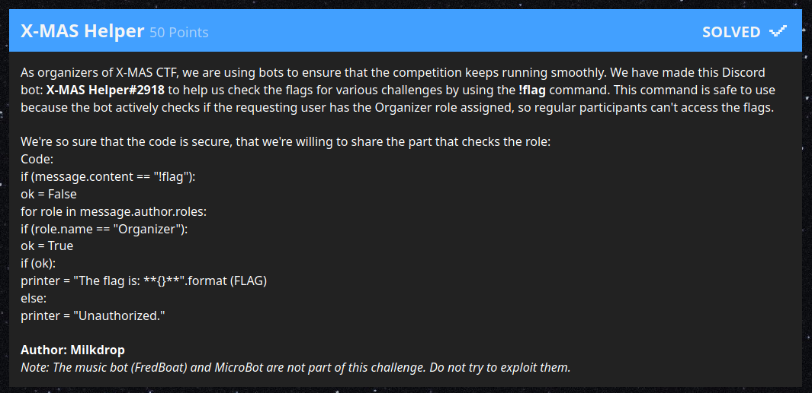
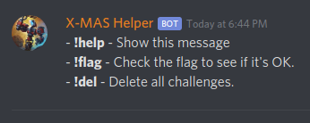

# X-MAS Helper

> As organizers of X-MAS CTF, we are using bots to ensure that the competition
> keeps running smoothly. We have made this Discord bot: X-MAS Helper#2918 to
> help us check the flags for various challenges by using the !flag command.
> This command is safe to use because the bot actively checks if the requesting
> user has the Organizer role assigned, so regular participants can't access the
> flags.
>
> We're so sure that the code is secure, that we're willing to share the part that checks the role:
>
> Code:
> ```
> if (message.content == "!flag"):
> ok = False
> for role in message.author.roles:
> if (role.name == "Organizer"):
> ok = True
> if (ok):
> printer = "The flag is: **{}**".format (FLAG)
> else:
> printer = "Unauthorized."
> ```



| Asset  | Note                                                                |
|--------|---------------------------------------------------------------------|
| Author | Milkdrop                                                            |

## Analysis

The code again, but properly indented:

```
 if (message.content == "!flag"):
   ok = False
 for role in message.author.roles:
   if (role.name == "Organizer"):
     ok = True
 if (ok):
   printer = "The flag is: **{}**".format (FLAG)
 else:
   printer = "Unauthorized."
```

Invite discord bot to your server. Get OAuth Client ID using Developer Tools.



